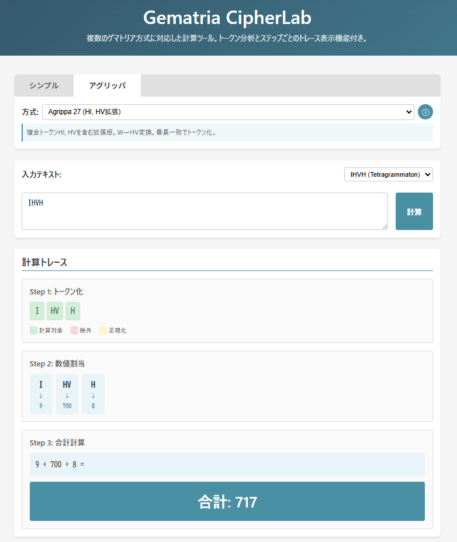

<!--
---
id: day109
slug: gematria-cipherlab

title: "Gematria CipherLab"

subtitle_ja: "ゲマトリア計算トレースツール"
subtitle_en: "Gematria Calculation Trace Tool"

description_ja: "複数のゲマトリア方式に対応し、トークン化から合計計算までの過程を可視化する教育・分析向けWebツール"
description_en: "Educational web tool supporting multiple gematria schemes with step-by-step calculation visualization"

category_ja:
  - 古典暗号
  - 数秘術
category_en:
  - Classical Cryptography
  - Numerology

difficulty: 1

tags:
  - gematria
  - agrippa-cipher
  - numerology
  - cryptography
  - static-web

repo_url: "https://github.com/ipusiron/gematria-cipherlab"
demo_url: "https://ipusiron.github.io/gematria-cipherlab/"

hub: true
---
-->

# Gematria CipherLab – ゲマトリア計算トレースツール


[](https://ipusiron.github.io/gematria-cipherlab/)

**Day109 - 生成AIで作るセキュリティツール200**

複数のゲマトリア方式を横断的に扱い、**トークン化 → 数値確定 → 合計計算** の過程を可視化する教育・分析向けのWebベース暗号・数秘ツールです。

---

## 🌐 デモページ

👉 **[https://ipusiron.github.io/gematria-cipherlab/](https://ipusiron.github.io/gematria-cipherlab/)**

ブラウザーで直接お試しいただけます。日本語・英語の切り替えに対応しています。

---

## 📸 スクリーンショット

> 
>
> *アグリッパ暗号での計算トレース：トークン化 → 数値割当 → 合計計算の3ステップを可視化*

---

## 📚 ゲマトリアとは

**ゲマトリア（Gematria）** とは、単なる「数を表記する方法」ではなく、言葉に隠された意味を数値から読み解く解釈の手法です。

元来はヘブライ語の神秘主義的・カバラ的な実践でしたが、現在では他の言語にも拡張されています。

### 古典的ゲマトリア

#### ヘブライ・ゲマトリア

ゲマトリアの本来の形式。ヘブライ文字に1〜400の数値を割り当てます。

| 1の位 | | 10の位 | | 100の位 | |
|-------|---|--------|---|---------|---|
| א (Aleph) | 1 | י (Yod) | 10 | ק (Qoph) | 100 |
| ב (Bet) | 2 | כ (Kaph) | 20 | ר (Resh) | 200 |
| ג (Gimel) | 3 | ל (Lamed) | 30 | ש (Shin) | 300 |
| ד (Dalet) | 4 | מ (Mem) | 40 | ת (Tav) | 400 |
| ה (He) | 5 | נ (Nun) | 50 | | |
| ו (Vav) | 6 | ס (Samekh) | 60 | | |
| ז (Zayin) | 7 | ע (Ayin) | 70 | | |
| ח (Chet) | 8 | פ (Pe) | 80 | | |
| ט (Tet) | 9 | צ (Tsade) | 90 | | |

**用途：** カバラ、ユダヤ神秘主義、聖書解釈

**例：** חי（chai、生命）= 8 + 10 = 18 → 縁起の良い数字とされる

#### ギリシャ・イソプセフィア（Isopsephy）

ヘブライ・ゲマトリアと同様のシステムをギリシャ文字に適用したもの。

| 1の位 | | 10の位 | | 100の位 | |
|-------|---|--------|---|---------|---|
| α (Alpha) | 1 | ι (Iota) | 10 | ρ (Rho) | 100 |
| β (Beta) | 2 | κ (Kappa) | 20 | σ (Sigma) | 200 |
| γ (Gamma) | 3 | λ (Lambda) | 30 | τ (Tau) | 300 |
| δ (Delta) | 4 | μ (Mu) | 40 | υ (Upsilon) | 400 |
| ε (Epsilon) | 5 | ν (Nu) | 50 | φ (Phi) | 500 |
| ϛ (Stigma) | 6 | ξ (Xi) | 60 | χ (Chi) | 600 |
| ζ (Zeta) | 7 | ο (Omicron) | 70 | ψ (Psi) | 700 |
| η (Eta) | 8 | π (Pi) | 80 | ω (Omega) | 800 |
| θ (Theta) | 9 | ϟ (Koppa) | 90 | ϡ (Sampi) | 900 |

**用途：** 古代ギリシャの数秘術、新約聖書解釈

**例：** χξϛ = 600 + 60 + 6 = 666（黙示録「獣の数字」）

### 歴史的背景

| 時期 | 出来事 |
|------|--------|
| 紀元前8世紀頃 | ギリシャ・ヘブライでアルファベット数字が使われ始める |
| 紀元前3世紀頃 | イソプセフィア・ゲマトリアの実践が文献に登場 |
| 紀元後 | カバラでゲマトリアが神秘主義的に発展 |
| 16世紀 | アグリッパがラテン文字への体系的拡張を著作で発表 |
| 19-20世紀 | 英語ゲマトリアが近代オカルティズムで考案される |

現在の学術的見解では、ギリシャのイソプセフィアとヘブライのゲマトリアは、ほぼ同時期（紀元前数世紀）に独立または相互影響で発展したと考えられています。

---

## ✨ 特徴

- **7方式対応**
  - Simple English A=0（A=0, B=1, ... Z=25）
  - Simple English A=1（A=1, B=2, ... Z=26）
  - English Gematria（A=6, B=12, ... Z=156）
  - Simple Latin23（I/J, U/V統合）
  - Agrippa 23（古典ラテン23文字版）
  - Agrippa 27（HI/HV拡張版）
  - Hebrew Gematria（ヘブライ文字、א=1〜ת=400）
- **トークン（可変長）を最小単位とする設計**
- **計算過程の完全可視化**
  - Step 1: Tokenization（トークン化）
  - Step 2: Mapping（数値確定）
  - Step 3: Summation（合計計算）
- **多言語対応**（日本語・英語切替）
- **教育用途を意識したUI**
  - トークン境界のハイライト
  - 参照テーブルとの相互ハイライト
  - 警告の二段構え表示
  - ヘブライ文字入力用オンスクリーンキーボード
- **Webセキュリティを考慮した設計**
  - GitHub Pages 公開前提
  - DOM XSS / URL注入 / 供給網リスクへの対策

---

## 📖 対応ゲマトリア方式

### Simple Gematria

英語アルファベットには古典的な数値対応が存在しないため、複数の人工的なシステムが考案されました。本ツールでは以下の方式に対応しています。

#### Simple English A=1（別名：English Ordinal）

最も一般的な英語ゲマトリア方式。

| A | B | C | D | E | F | G | H | I | J | K | L | M |
|---|---|---|---|---|---|---|---|---|---|---|---|---|
| 1 | 2 | 3 | 4 | 5 | 6 | 7 | 8 | 9 | 10 | 11 | 12 | 13 |

| N | O | P | Q | R | S | T | U | V | W | X | Y | Z |
|---|---|---|---|---|---|---|---|---|---|---|---|---|
| 14 | 15 | 16 | 17 | 18 | 19 | 20 | 21 | 22 | 23 | 24 | 25 | 26 |

**用途：** 数秘術、パズル、一般的な文字↔数値変換

#### Simple English A=0（Zero-indexed Ordinal）

プログラミングや暗号学で使用されるゼロインデックス方式。

| A | B | C | D | E | F | G | H | I | J | K | L | M |
|---|---|---|---|---|---|---|---|---|---|---|---|---|
| 0 | 1 | 2 | 3 | 4 | 5 | 6 | 7 | 8 | 9 | 10 | 11 | 12 |

| N | O | P | Q | R | S | T | U | V | W | X | Y | Z |
|---|---|---|---|---|---|---|---|---|---|---|---|---|
| 13 | 14 | 15 | 16 | 17 | 18 | 19 | 20 | 21 | 22 | 23 | 24 | 25 |

**用途：** プログラミング、暗号学（配列インデックスが0始まりのため）

#### Simple Latin23

古典ラテンアルファベット（23文字）に基づく方式。J→I、U→V に正規化し、W は未定義として警告付きで除外します。

#### English Gematria（6の倍数方式）

**別名：** English Sumerian Gematria

**方式：** A=6, B=12, C=18, ... Z=156（6の倍数）

| A | B | C | D | E | F | G | H | I | J | K | L | M |
|---|---|---|---|---|---|---|---|---|---|---|---|---|
| 6 | 12 | 18 | 24 | 30 | 36 | 42 | 48 | 54 | 60 | 66 | 72 | 78 |

| N | O | P | Q | R | S | T | U | V | W | X | Y | Z |
|---|---|---|---|---|---|---|---|---|---|---|---|---|
| 84 | 90 | 96 | 102 | 108 | 114 | 120 | 126 | 132 | 138 | 144 | 150 | 156 |

**起源：** 19-20世紀の近代オカルティズム。アレイスター・クロウリー（Aleister Crowley）らが儀式魔術の著作を通じて普及に貢献。古代からの伝統ではなく、近代に人工的に作られたシステム。

**用途：** 主に以下の文脈で使用される。

- **終末論・黙示録解釈** — 「獣の数字666」を現代の事物に当てはめる
- **オカルト・数秘術** — 神秘主義的な意味を見出す実践
- **陰謀論** — 政治家、企業、技術が「悪魔的」であると主張する文脈

**666になる単語の例：**

| 単語 | 計算式 | 合計 |
|------|--------|------|
| COMPUTER | 18+90+78+96+126+120+30+108 | 666 |
| WITCHCRAFT | 138+54+120+18+48+18+108+6+36+120 | 666 |
| KISSINGER | 66+54+114+114+54+84+42+30+108 | 666 |
| MONSANTO | 78+90+84+114+6+84+120+90 | 666 |
| MARK OF BEAST | 78+6+108+66+90+36+12+30+6+114+120 | 666 |

> **注意：** 学術的な暗号学や歴史的な記数法とは異なる、比較的新しい人工的なシステムです。

---

### Agrippa Cipher（アグリッパ暗号）

アグリッパ暗号は、ルネサンス期の魔術師・オカルティスト **ハインリヒ・コルネリウス・アグリッパ**（Heinrich Cornelius Agrippa von Nettesheim, 1486–1535）が著書『**隠秘哲学について（De Occulta Philosophia Libri Tres）**』で体系化した **ラテン文字のゲマトリア（数秘術的換字システム）** です。

#### 23文字版（16世紀ラテンアルファベット）

| 区分 | 文字 | 数値 |
|------|------|------|
| Units | A–I | 1–9 |
| Tens | K–S | 10–90 |
| Hundreds | T, V, X, Y, Z | 100–500 |

**エイリアス処理**: J → I（9）、U → V（200）、W → 未定義（警告して除外）

#### 27文字版（拡張版）

| 追加 | 数値 | 備考 |
|-----|------|------|
| J | 600 | 子音の I |
| V | 700 | 子音の V |
| HI | 800 | ダイグラフ |
| HV (W) | 900 | ダイグラフ |

### Agrippa 23 / 27 の違い

| 項目 | Agrippa 23 | Agrippa 27 |
|------|-----------|-----------|
| トークン | 1文字のみ | 1文字 + HI/HV |
| HI/HV | 分割される | 2文字トークン |
| W | 未定義 | HV として扱う |

同じ入力でも、方式によって **トークン化結果と合計値が変化** します。

### 方式の比較表

| 方式 | 対応 | 起源 | 主な用途 |
|------|------|------|----------|
| ヘブライ・ゲマトリア | א=1, ב=2... | 古代（紀元前） | カバラ、聖書解釈 |
| ギリシャ・イソプセフィア | α=1, β=2... | 古代（紀元前） | 数秘術、聖書解釈 |
| Simple English A=1 | A=1, B=2... | 近代 | パズル、一般的変換 |
| Simple English A=0 | A=0, B=1... | 近代 | プログラミング、暗号学 |
| English Gematria | A=6, B=12... | 19-20世紀 | オカルト、数秘術 |
| Agrippa 23/27 | ラテン23/27文字 | 16世紀 | 数秘術、古典暗号研究 |
| Hebrew Gematria | א=1, ב=2... | 古代（紀元前） | カバラ、聖書解釈（本ツール実装） |

---

## 🔬 計算過程の可視化

計算を以下の **3ステップ** で表示します。

1. **Tokenization** – トークン境界をハイライト表示
2. **Mapping** – トークンごとの数値確定
3. **Summation** – 人間に読みやすい式表示（例：`HI(800) + HV(900) = 1700`）

### トークンの状態

| 状態 | 説明 | 表示 |
|------|------|------|
| Included | 計算に含める | 緑系背景 |
| Excluded | 未定義のため除外 | 赤系背景 + 取消線 |
| Normalized | 正規化して含める | 黄系背景（例：J→I） |

---

## 🎯 プリセット例題

各方式に **プリセット例題（3種類）** を用意しています。

- **Basic** – 基本的な計算確認
- **Difference** – 方式差が出る例
- **Warning** – 未定義トークンの挙動確認

---

## 🔒 セキュリティ設計

本ツールは **静的Webツールとしての安全性** を重視しています。

- `innerHTML` の使用を最小限に抑制（`textContent` / `replaceChildren()` を使用）
- ユーザー入力は常にエスケープして描画
- CSP（Content Security Policy）を設定
- `Object.freeze()` でデータオブジェクトを凍結
- 外部送信・APIキー保持は行わない

---

## 🔗 関連リソース

### ゲマトリア全般

- [Wikipedia – Gematria](https://en.wikipedia.org/wiki/Gematria)
- [Wikipedia – Isopsephy](https://en.wikipedia.org/wiki/Isopsephy)

### アグリッパ暗号

- [Esoteric Archives – Agrippa](https://www.esotericarchives.com/agrippa/agripp2b.htm)
- [Internet Archive – De Occulta Philosophia（1533年版）](https://archive.org/details/DeOccultaPhilosophiaLoc1533)
- [Wikipedia – Three Books of Occult Philosophy](https://en.wikipedia.org/wiki/Three_Books_of_Occult_Philosophy)

---

## 📁 ディレクトリー構造

```
gematria-cipherlab/
├── index.html          # メインHTMLファイル
├── script.js           # アプリケーションロジック
├── style.css           # スタイルシート（モバイルファースト）
├── README.md           # 本ドキュメント
├── LICENSE             # ライセンスファイル
├── CLAUDE.md           # Claude Code用プロジェクト情報
├── assets/
│   └── screenshot.png  # スクリーンショット
└── docs/
    ├── detailed_design.md  # 詳細設計書
    ├── ui_spec.md          # 画面仕様書
    └── hosoku.md           # ゲマトリア補足資料
```

---

## 📄 ライセンス

- ソースコードのライセンスは `LICENSE` ファイルを参照してください。

---

## 🛠️ このツールについて

本ツールは、「生成AIで作るセキュリティツール200」プロジェクトの一環として開発されました。
このプロジェクトでは、AIの支援を活用しながら、セキュリティに関連するさまざまなツールを200日間にわたり制作・公開していく取り組みを行っています。

プロジェクトの詳細や他のツールについては、以下のページをご覧ください。

🔗 [https://akademeia.info/?page_id=44607](https://akademeia.info/?page_id=44607)
